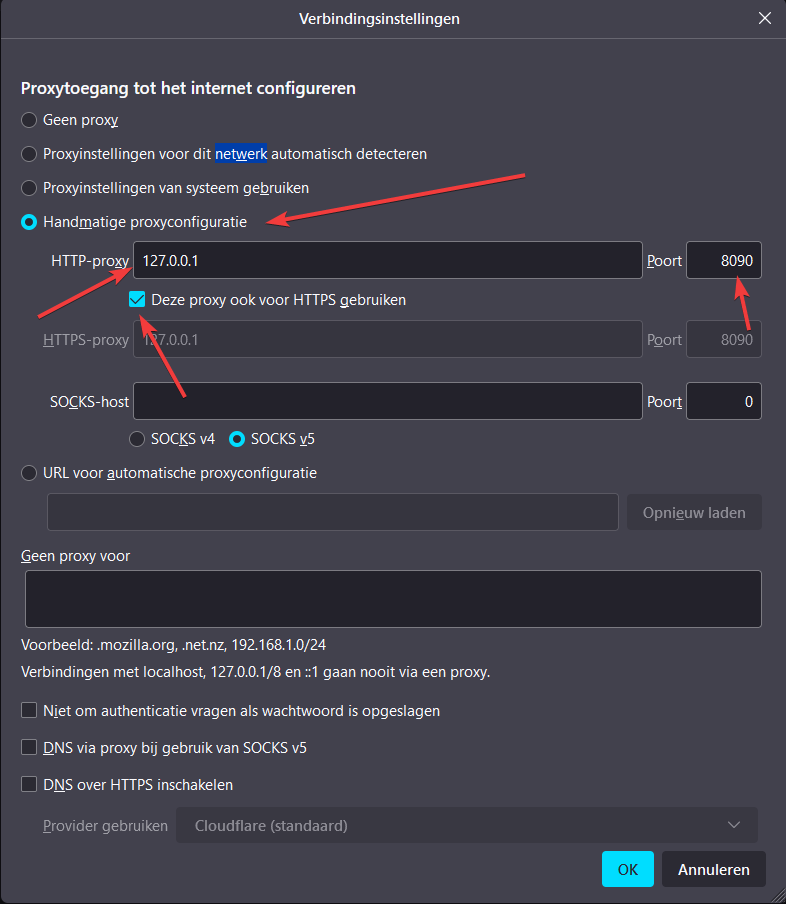
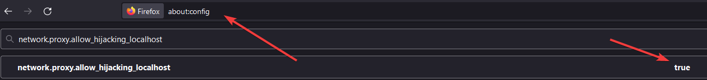
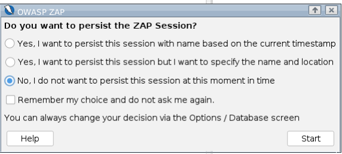
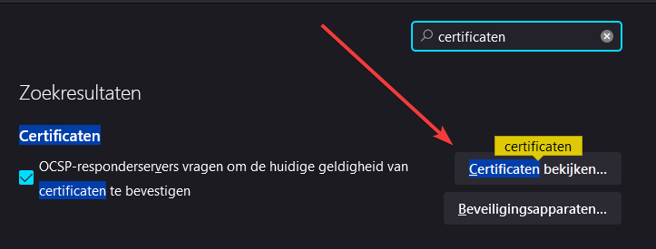
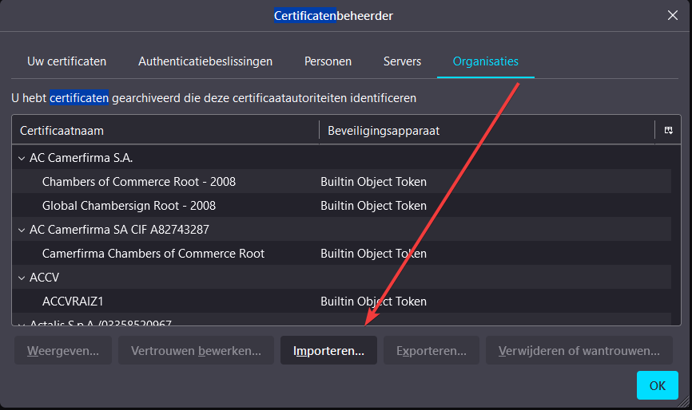
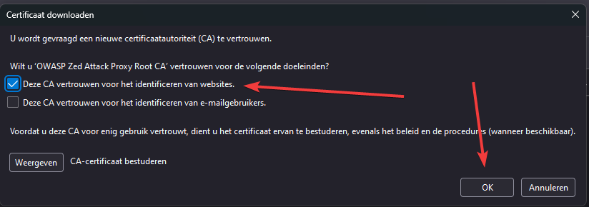
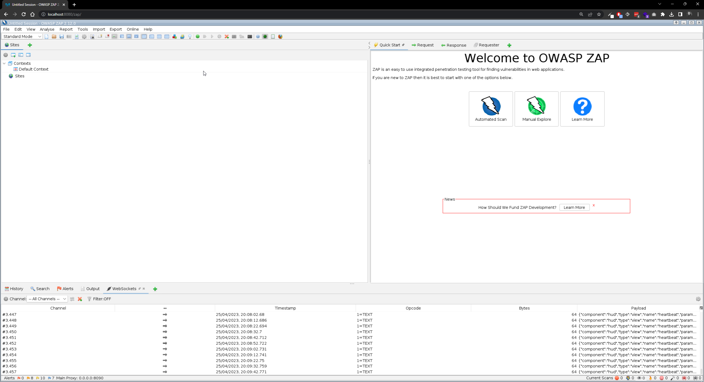
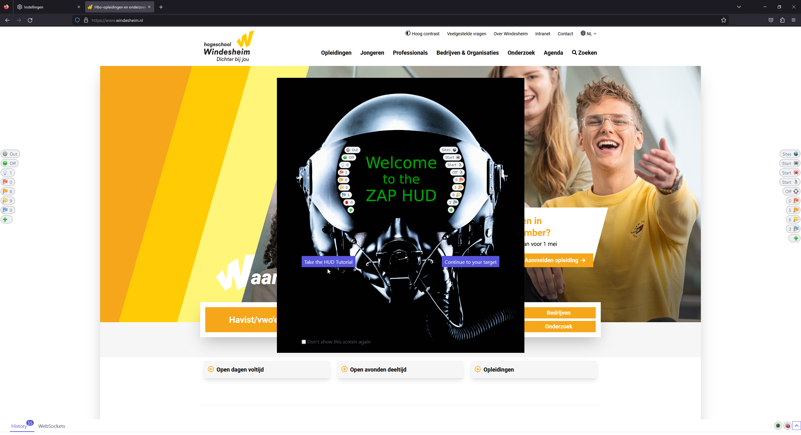
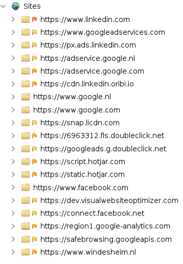

# ZAP
Dit voorbeeld laat zien hoe ZAP met behulp van Docker eenvoudig gestart kan worden:

`docker compose up -d`

Hierna is ZAP beschikbaar op http://localhost:8080/zap
En de proxy op http://localhost:8090

## Instellen proxy
Om de proxy te gebruiken moet de browser geconfigureerd worden om de proxy te gebruiken.
Voor het voorbeeld wordt Firefox gebruikt.
Het is belangrijk dat je de proxy instelt in je secundaire browser.
Voor het voorbeeld wordt Firefox gebruikt.
Voor andere browsers volg de instructies [hier](https://www.zaproxy.org/docs/desktop/start/proxies/).

Open Firefox en ga naar de instellingen.
Zoek naar netwerkinstellingen en klik op `Instellingen...`.
Hier moet de proxy ingesteld worden.
Vink `Handmatige proxyconfiguratie` aan en vul bij `HTTP Proxy` `127.0.0.1` in en bij `Poort` `8090`.
Vink `Deze proxy ook voor HTTPS gebruiken` aan en klik op `OK`.

Op Firefox moet worden ingesteld dat de proxy `localhost` mag `hijacken`.
Dit is nodig omdat de proxy anders niet werkt.
Ga naar `about:config` en zoek naar `network.proxy.allow_hijacking_localhost`.
Zet deze op `true`. Dit kan door erop te dubbelklikken.

## Installeren certificaat
Om de proxy te gebruiken moet het certificaat van de proxy geïnstalleerd worden.
Dit certificaat wordt aangemaakt zodra zap een keer opgestart is.
Het opstarten is te doen door de site http://localhost:8080/zap te bezoeken.
Hier wordt gevraagd of je een sessie wilt openen, een nieuwe sessie wilt starten of geen sessie wilt starten.
De keuze maakt niet uit, het gaat erom dat ZAP opgestart wordt.

Nu is het certificaat aangemaakt en te vinden in de map `data` in de map waar dit bestand staat.

Het certificaat kan nu geïnstalleerd worden in de browser.
Het is belangrijk dat je het certificaat installeert in je secundaire browser net als je de proxy instelt in je secundaire browser.
Voor het voorbeeld wordt Firefox om het certificaat te installeren.
Voor andere browsers volg de instructies [hier](https://www.zaproxy.org/docs/desktop/addons/network/options/servercertificates/).

Open Firefox en ga naar de instellingen.
Zoek naar certificaten en klik op `Certificaten bekijken`.

Ga naar het tabblad `Organisaties` en klik op `Importeren`.
En navigeer naar het certificaat dat net id aangemaakt in de map `data`.

Vink `Vertrouw deze CA om websites te identificeren` aan en klik op `OK`.

Nu is het certificaat geïnstalleerd en kan de proxy gebruikt worden.

## Zap gebruiken
Nu de proxy is ingesteld en het certificaat is geïnstalleerd kan ZAP gebruikt worden.
Open ZAP op http://localhost:8080/zap.
Hier kan de proxy gebruikt worden om verkeer te onderscheppen.

Op je secundaire browser kan je nu een website bezoeken en het verkeer wordt onderschept door ZAP.
Ook zal hier de ZAP-hud te zien zijn.

Wanneer je een website bezoekt in de secundaire browser zal je zien dat er verkeer onderschept wordt door ZAP. 

## Stoppen
Om ZAP te stoppen kan het volgende commando uitgevoerd worden:

`docker compose down`

Als zap niet draait zul heeft je secundaire browser geen internetverbinding meer. Om dit op te lossen moet de proxy uitgezet worden. Dit is te doen om in de instellingen van het netwerk het vinkje bij `Handmatige proxyconfiguratie` uit te zetten en weer terug zetten naar `Proxyinstellingen van systeem gebruiken`.

